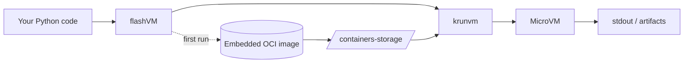

# flashVM

Run short Python snippets in a microVM for strong isolation—without asking users to pull images or learn container tooling. On first run, flashVM imports an embedded OCI image into local containers-storage, and then boots a microVM via krunvm (libkrun). The result (stdout, exit code, and optional artifacts) is returned to your Python process.

**Under the hood:** krunvm is a CLI for creating microVMs from OCI images using libkrun and buildah; it targets Linux/KVM.  
The embedded image uses standard OCI transports; tools like skopeo can copy oci: layouts into containers-storage: for local use.

## Why flashVM?

- **Real isolation:** Code executes inside a tiny KVM-backed microVM (via libkrun).
- **Zero setup for images:** A minimal Python image ships inside the wheel (OCI layout) and is auto-imported on first run.
- **Friendly API:** One call in Python (`flashvm.run(...)`) returns stdout/stderr, exit code, and optional output files (“artifacts”).

## How it works



> krunvm: “CLI-based utility for creating microVMs from OCI images, using libkrun and buildah” and targeting Linux/KVM.  
> OCI transports: oci:PATH[:ref] and containers-storage:… are standard transports; skopeo copy can move images between them (e.g., oci: → containers-storage:).

## Requirements

### Host OS / hardware
- Linux with KVM available (i.e., /dev/kvm exists), because krunvm/libkrun rely on KVM.

### System tools (installed on the host)
- **krunvm** – microVM launcher.
- **buildah** – used by krunvm and for rootless image operations.
- **skopeo** (optional but recommended) – for fast, policy-aware copying of the embedded oci: layout into local containers-storage: on first run.

> Package names are typically krunvm, buildah, and skopeo on mainstream distros. See your distribution’s repositories or the krunvm project page for install options.

### Python
- Python 3.8+.

## Installation

From PyPI:
```bash
pip install flashvm
```

From source (editable dev mode):
```bash
pip install maturin
maturin develop
```

> krunvm/buildah/skopeo are host tools, installed via your OS package manager. See the krunvm repository for up-to-date guidance.

## Quick start

```python
import flashvm as fvm

# Optional: import the embedded OCI image into containers-storage now (idempotent)
fvm.prepare_image()  # First run does this automatically if you skip it.

# Run a short snippet in a microVM
res = fvm.run("print('Hello from microVM!')")
print("exit:", res["exit_code"])
print("stdout:", res["stdout"])
print("stderr:", res["stderr"])
print("image_used:", res["image_used"])
```

> Example with artifacts:

```python
code = r"""
with open('/work/out/result.txt', 'w') as f:
    f.write('ok\n')
print('done')
"""

res = fvm.run(code, expect=["out/*.txt"])
for a in res["artifacts"]:
    print(a["guest_path"], a["size_bytes"])
```

## What ships in the wheel?

An embedded OCI image layout (minimal Python userspace) placed inside the package data.

> On first use, flashVM imports that layout into local containers-storage: (using skopeo copy if present; otherwise a buildah fallback), then boots it via krunvm.

## Troubleshooting

- **“KVM not available”** – ensure hardware virtualization is enabled in BIOS/UEFI and /dev/kvm exists (group permissions may apply). krunvm targets Linux/KVM.
- **Image/transport errors** – skopeo copy supports oci: and containers-storage: transports. If skopeo isn’t installed, flashVM falls back to buildah-based import.
- **Rootless storage** – buildah and the underlying containers stack use containers-storage; this is the local image store queried by tools (buildah images, etc.). Transport syntax and examples are documented in the containers-transports manpage.

## Security / Isolation notes

> flashVM relies on krunvm (which uses libkrun) to run each execution inside a microVM. This provides stronger isolation than plain containers while keeping startup latency low. See the krunvm project for background and supported platforms.

## License

MIT (this project). krunvm/libkrun and the containers tooling are separate projects with their own licenses. See upstream repositories for details.

## Acknowledgments

The krunvm project and libkrun for making userspace microVMs practical.

The containers ecosystem (buildah, skopeo, containers-image/storage) for robust image transports—especially oci: and containers-storage:.

## Appendix: Useful references

- krunvm project page (overview, install, supported platforms).
- containers-transports manpage (syntax for oci:… and containers-storage:…, examples with skopeo copy).
